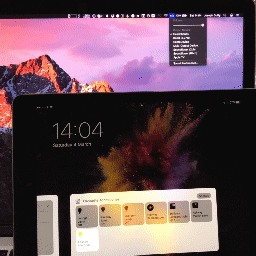

#homebridge-pc-volume
[](https://www.npmjs.com/package/homebridge-pc-volume) []()

homebridge-pc-volume is a Homebridge plugin that adds a support for changing a computer's volume using HomeKit and Siri.



##OS Support

homebridge-pc-volume utilises [node-loudness](https://github.com/LinusU/node-loudness), which currently supports macOS and Linux (using ALSA).

HomeKit is supported by iOS. Note that HomeKit does not support the "speaker" accessory type, so this will be shown as a lightbulb. If anyone knows how to get iOS to support a speaker, please create an issue or a PR.

##Installation

First, [install Homebridge](https://github.com/nfarina/homebridge#installation).

Then install homebridge-pc-volume via `npm`:

`npm install -g homebridge-pc-volume`

homebridge-pc-volume will also need to be specified as an accessory in your `~/.homebridge/config.json`:

```
  "accessories": [
    {
      "accessory": "Computer",
      "name": "MacBook"
    }
  ]
```

Note that `accessory` _must_ be "Computer", while the `name` can be any value of your choosing.